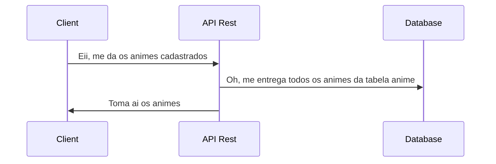
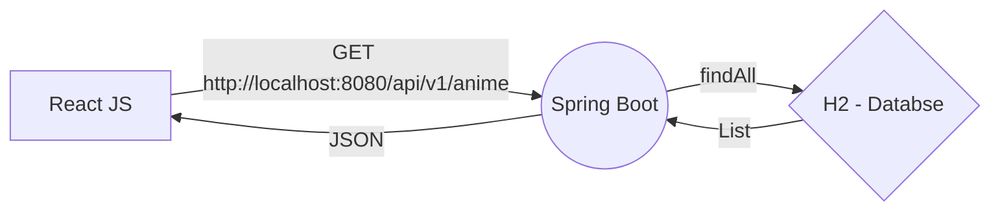

# Nimex 🎴
A **Nimex** é uma aplicativo simples de cadastro, listagem, detalhamento e deleção de animes. O intuito desse projeto _Fullstack_ é ter um projeto simples para currículos que crie uma primeira comunicação entre o _Front-End_, _Back-End_ e o _Banco de Dados_! Conforme o tempo vamos melhorando e adicionando mais funcionalidades para o App! 
Vamos começar? 🚀
> By: VitorRT 💌

## Tecnologias e Ferramentas Para o Desenvolvimento 🔨
- Para o **Back-End**: Spring Boot 
- Para o **Front-End**: React JS
- Nosso **Banco de Dados de Desenvolvimento**: H2
- Nosso **Banco de Dados de Produção**: Oracle
- Para a **Conteinerização e Up dos containers**: Docker & Docker Compose

## Vamos usar técnicas de versionamento para a Nimex! 
Para controlar as versões do app da Nimex, vamos utilizar a incrível ferramenta `Git` e utilizar o `git flow` para todo o desenvolvimento já utilizando termos padrões do mercado!

# Estrutura do Projeto 🧮
Vamos entender melhor sobre como será a estrutura do projeto da Nimex. Vamos chamar o  _Front-End_ de "Client", o _Back-End_ de "API Rest", e o _Banco de Dados_ (Produção/Desenvolvimento) de "Database"! O modelo que iremos trabalhar foge do tradicional _"MVC"_, porque estamos separando as aplicações de _Front-End_, _Back-End_ e o _Banco de Dados_.

## Comunicação Entre as Áreas

Esse modelo UML diz a respeito sobre a comunicação entre as áreas da aplicação.



De uma outra representação, aqui está algo mais técnico:




# Levantamento de Requisitos 💻

## Requisitos Funcionais
 - O software deve permitir o cadastro de animes.
 - O software não deve permitir o cadastro de animes com campos requeridos faltando.
 - O software sempre deve redirecionar o usuário para a home page após um cadastro de anime.
 - Quando o usuário tentar cadastrar um anime com campos requeridos faltando, o software deve barrar e redirecionar o usuário para a pagina de cadastro novamente com os campos preenchidos salvos.
 - Quando o usuário for barrado pelo software ao tentar cadastrar uma anime, o software deve enviar uma notificação vermelha com a mensagem do erro.
 - Toda vez que o usuario entrar na home page, o software deve carregar todos os animes cadastrados no banco de dados. Caso não tenha nenhum anime cadastrado, o software deve mandar uma mensagem avisando ao cliente que não tem nenhuma anime salvo no banco.
 - O software deve permitir que o usuario edite seus animes cadastrados.
 - O software deve permitir apenas campos específicos do anime para serem editados.
 - Quando o usuario editar os campos, o software deve o redirecionar de volta para a home page ja mostrando uma mensagem azul oceano que a edição foi bem sucedida.
 - O software deve permitir a deleção de animes.
 - Quando o usuario clicar para deletar um anime, o software deve abrir um modal pedindo uma confirmação da ação.
 - Depois de um usuario excluir uma anime, o software deve redirecionar ele para a home page ja mostrando uma mensagem amarela avisando que o anime foi deletado com sucesso.


## Requisitos Não Funcional 📼
- O software é totalmente gratuito.
- O software deve ser liso e leve.'
- O software deve passar uma comunicação simples e moderna.
- Todos os dados sensíveis devem ser protegidos.


# Sprints de Entregas - API Rest 👨🏾‍💻

- [x] Configuração de Ambiente. - Aula 03
- [x] Rodar o primeiro "Hello, World!". -  Aula 03
- [x] Criar domínio para o anime. -  Aula 04
- [x] Criar um controlador para as requisições de anime. -  Aula 04
- [x] Estabelecer Conexão com o Banco de Dados - Aula 05
- [x]  Tornar dominio anime para uma entidade - Aula 05
- [x] Criar um repositório para o anime. -  Aula 05
- [x] Desenvolver CRUD ( DTO's...). -  Aula 06
- [x] Aplicar validações. -  Aula 06
- [x] Aplicar boas práticas (Resposta, Status Code...). -  Aula 07
- [x] Tratar erros das requisições (Com respostas). -  Aula 08
- [x] Aplicar a paginação -  Aula 09
- [x] Fazer "Deploy"-  Aula 09

> Pra cima 🔥🚀


# Nimex API Rest 🎴💻
Documentação oficial da API Rest da **Nimex**! Essa API responde as boas práticas do modelo REST, contendo validações no cadastro e na edição dos domínios, respostas com status code apropriado.

## Endpoint - `/api/v1/anime`
`GET` /api/v1/anime
Exemplo de resposta 👇🏾
````js
{
	"content": [
		{
			"id": 1,
			"title": "Solo Leveling",
			"image": "solo_leveling.png",
			"score": 8.4
		}
	],
	"pageable": {
		"sort": {
			"empty": true,
			"sorted": false,
			"unsorted": true
		},
		"offset": 0,
		"pageNumber": 0,
		"pageSize": 10,
		"unpaged": false,
		"paged": true
	},
	"totalPages": 1,
	"totalElements": 1,
	"last": true,
	"size": 10,
	"number": 0,
	"sort": {
		"empty": true,
		"sorted": false,
		"unsorted": true
	},
	"numberOfElements": 1,
	"first": true,
	"empty": false
}
````


---

`POST` /api/v1/anime

Exemplo de entrada 👇🏾
````js
{
	"title": "Solo Leveling",
	"synopsis": "Dez anos atrás, depois do “Portal” que conecta o mundo real com um mundo de monstros se abrir, algumas pessoas comuns receberam o poder de caçar os monstros do portal. Eles são conhecidos como caçadores. Porém, nem todos os caçadores são fortes.",
	"score": 8.4,
	"status": "FORA_DO_AR",
	"genres": "Shounnen, Drama, Luta",
	"image": "solo_leveling.png"
}
````
**O campo "status" tem apenas dois valores possíveis: "FORA_DO_AR" e "EXIBINDO" (maiúsculas)**

Exemplo de resposta 👇🏾
````js
{
	"title": "Solo Leveling",
	"synopsis": "Dez anos atrás, depois do “Portal” que conecta o mundo real com um mundo de monstros se abrir, algumas pessoas comuns receberam o poder de caçar os monstros do portal. Eles são conhecidos como caçadores. Porém, nem todos os caçadores são fortes.",
	"score": 8.4,
	"status": "FORA_DO_AR",
	"genres": "Shounnen, Drama, Luta",
	"image": "solo_leveling.png"
}
````


--- 

`PUT` /api/v1/anime/{id}

Exemplo de entrada 👇🏾
````js
{
	"title": "Solo Leveling",
	"synopsis": "Dez anos atrás, depois do “Portal” que conecta o mundo real com um mundo de monstros se abrir, algumas pessoas comuns receberam o poder de caçar os monstros do portal. Eles são conhecidos como caçadores. Porém, nem todos os caçadores são fortes.",
	"score": 8.4,
	"status": "FORA_DO_AR",
	"genres": "Shounnen, Drama, Luta",
	"image": "solo_leveling.png"
}
````
**O campo "status" tem apenas dois valores possíveis: "FORA_DO_AR" e "EXIBINDO" (maiúsculas)**

Exemplo de resposta 👇🏾
````js
{
	"title": "Solo Leveling",
	"synopsis": "Dez anos atrás, depois do “Portal” que conecta o mundo real com um mundo de monstros se abrir, algumas pessoas comuns receberam o poder de caçar os monstros do portal. Eles são conhecidos como caçadores. Porém, nem todos os caçadores são fortes.",
	"score": 8.4,
	"status": "FORA_DO_AR",
	"genres": "Shounnen, Drama, Luta",
	"image": "solo_leveling.png"
}
````

---
`GET` /api/v1/anime/{id}
Exemplo de resposta 👇🏾
````js
{
	"title": "Solo Leveling",
	"synopsis": "Dez anos atrás, depois do “Portal” que conecta o mundo real com um mundo de monstros se abrir, algumas pessoas comuns receberam o poder de caçar os monstros do portal. Eles são conhecidos como caçadores. Porém, nem todos os caçadores são fortes.",
	"score": 8.4,
	"status": "FORA_DO_AR",
	"genres": "Shounnen, Drama, Luta",
	"image": "solo_leveling.png"
}
````

---
`DELETE` /api/v1/anime/{id}
Exemplo de resposta -> 204 No Content

## Instruções 💬

 - Clone o repositório;
 -	Abra o terminal e digite `nimex-api` para entrar dentro da pasta raiz da api.
 -	Digite o seguinte comando `docker-compose up -d` para subir os containers em background.
